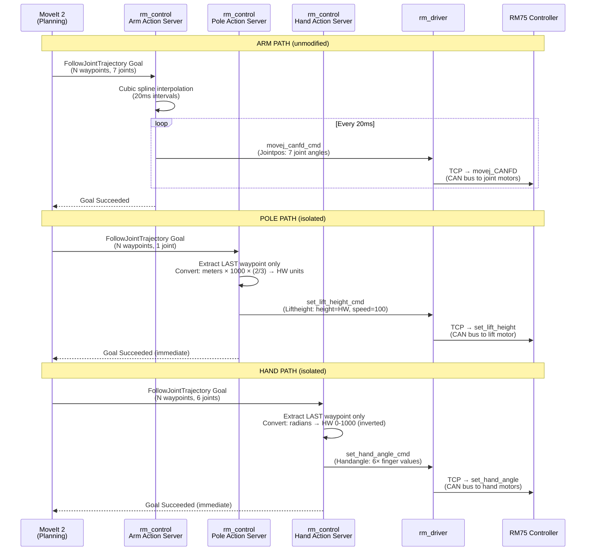
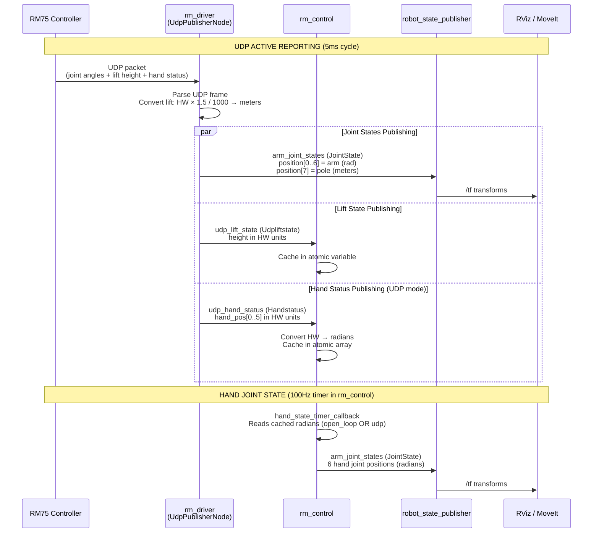
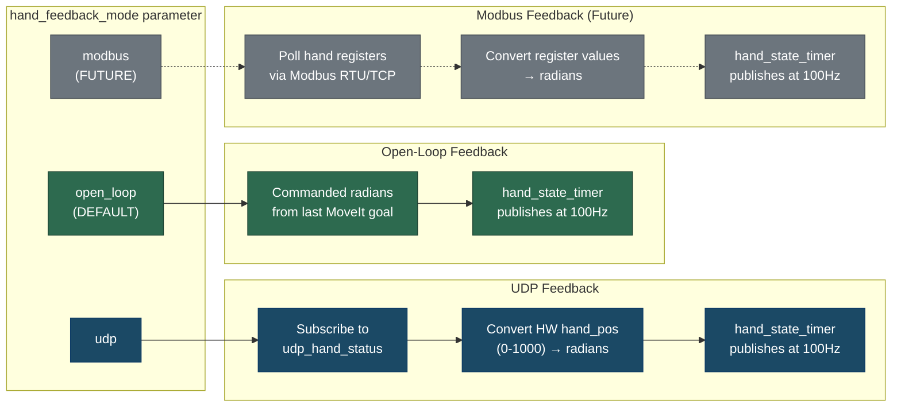

# Pole & Dexterous Hand Integration Guide

## Revision History

| Version | Date       | Comment                                              |
|:-------:|:----------:|:----------------------------------------------------:|
| V1.0    | 03/09/2026 | Initial pole/lift integration documentation          |
| V2.0    | 03/10/2026 | Added dexterous hand integration; combined document  |

---

## Table of Contents

1. [Overview](#1-overview)
2. [System Architecture](#2-system-architecture)
3. [Communication Flow](#3-communication-flow)
4. [Protocol & Transport Details](#4-protocol--transport-details)
5. [Unit Conversion](#5-unit-conversion)
6. [Hand Feedback Modes](#6-hand-feedback-modes)
7. [ROS 2 Interface Reference](#7-ros-2-interface-reference)
8. [Configuration Reference](#8-configuration-reference)
9. [Launch Configuration](#9-launch-configuration)
10. [Design Decisions & Constraints](#10-design-decisions--constraints)
11. [Troubleshooting](#11-troubleshooting)

---

## 1. Overview

Two peripherals are integrated into the RM75 dual-arm system via MoveIt 2, isolated from the arm's joint control loop:

- **Pole (vertical lift / sliding plate mechanism)** — a prismatic joint that raises and lowers the arm assembly along a vertical rail.
- **Dexterous Hand** — a 6-DOF under-actuated gripper attached to each arm's end-effector, with configurable feedback modes.

Both use the same pattern: a dedicated `FollowJointTrajectory` action server in `rm_control`, fire-and-forget command dispatch, and no shared state with the arm path.

### Key Characteristics — Pole

| Property             | Value                                      |
|----------------------|--------------------------------------------|
| Joint type           | Prismatic (linear)                         |
| Physical range       | 0–300 mm                                   |
| Hardware range       | 0–200 hardware units                       |
| MoveIt range         | 0–0.3 m                                    |
| Joint names          | `L_sliding_plate_joint` / `R_sliding_plate_joint` |
| Control method       | Position command (fire-and-forget)          |
| Interpolation        | None — last waypoint only                  |
| Speed                | Fixed at 100%                              |

### Key Characteristics — Dexterous Hand

| Property             | Value                                                         |
|----------------------|---------------------------------------------------------------|
| Joint type           | Revolute (6 under-actuated DOF)                               |
| DOF                  | 6 (little, ring, middle, index, thumb flex, thumb rotation)   |
| Hardware range       | 0–1000 per finger (0 = closed, 1000 = open)                  |
| MoveIt range         | 0–max radians per joint (from URDF limits)                    |
| Joint names (left)   | `L_thumb_1_joint`, `L_thumb_2_joint`, `L_index_1_joint`, `L_middle_1_joint`, `L_ring_1_joint`, `L_little_1_joint` |
| Joint names (right)  | `R_thumb_1_joint`, `R_thumb_2_joint`, `R_index_1_joint`, `R_middle_1_joint`, `R_ring_1_joint`, `R_little_1_joint` |
| Control method       | Position command (fire-and-forget)                            |
| Interpolation        | None — last waypoint only                                     |
| Feedback mode        | Configurable: `open_loop` (default), `udp`, `modbus` (future) |

---

## 2. System Architecture

The arm, pole, and hand each have independent data paths within the same `rm_control` node. No pole or hand code runs in the arm's timer callback or touches arm state variables.

```
┌─────────────────────────────────────────────────────────────────────────────────────────┐
│                                      MoveIt 2                                           │
│                                                                                         │
│  ┌─────────────────────┐    ┌──────────────────────┐    ┌──────────────────────┐        │
│  │  Arm Planning Group  │    │  Pole Planning Group  │    │  Hand Planning Group  │        │
│  │  (7-DOF revolute)    │    │  (1-DOF prismatic)    │    │  (6-DOF revolute)     │        │
│  └─────────┬───────────┘    └──────────┬───────────┘    └──────────┬───────────┘        │
│            │                           │                           │                    │
│   FollowJointTrajectory       FollowJointTrajectory       FollowJointTrajectory         │
│   Action Goal                 Action Goal                 Action Goal                   │
└────────────┼───────────────────────────┼───────────────────────────┼─────────────────────┘
             │                           │                           │
             ▼                           ▼                           ▼
┌─────────────────────────────────────────────────────────────────────────────────────────┐
│                                   rm_control Node                                       │
│                                                                                         │
│  ┌─────────────────────┐    ┌──────────────────────┐    ┌──────────────────────┐        │
│  │  Arm Action Server   │    │  Pole Action Server   │    │  Hand Action Server   │        │
│  │                      │    │                       │    │                       │        │
│  │  • Cubic spline      │    │  • No interpolation   │    │  • No interpolation   │        │
│  │    interpolation     │    │  • Last waypoint only │    │  • Last waypoint only │        │
│  │  • 20ms timer-based  │    │  • Fire-and-forget    │    │  • Fire-and-forget    │        │
│  │    streaming         │    │  • Unit conversion    │    │  • Unit conversion    │        │
│  │                      │    │                       │    │  • 100Hz JointState   │        │
│  │                      │    │                       │    │    publisher           │        │
│  └─────────┬───────────┘    └──────────┬───────────┘    └──────────┬───────────┘        │
│            │                           │                           │                    │
│   movej_canfd_cmd             set_lift_height_cmd         set_hand_angle_cmd            │
│   (Jointpos msg)              (Liftheight msg)            (Handangle msg)               │
└────────────┼───────────────────────────┼───────────────────────────┼─────────────────────┘
             │                           │                           │
             ▼                           ▼                           ▼
┌─────────────────────────────────────────────────────────────────────────────────────────┐
│                                   rm_driver Node                                        │
│                                                                                         │
│  ┌─────────────────────┐    ┌──────────────────────┐    ┌──────────────────────┐        │
│  │  TCP Command Handler │    │  Lift Command Handler │    │  Hand Command Handler │        │
│  │  (movej_CANFD)       │    │  (set_lift_height)    │    │  (set_hand_angle)     │        │
│  └─────────┬───────────┘    └──────────┬───────────┘    └──────────┬───────────┘        │
│            │                           │                           │                    │
│            ▼                           ▼                           ▼                    │
│  ┌───────────────────────────────────────────────────────────────────────────────┐      │
│  │                          UDP Active Reporting                                 │      │
│  │                                                                               │      │
│  │  arm_joint_states (JointState)                                                │      │
│  │   ├── position[0..6] : arm joints (radians)                                   │      │
│  │   └── position[7]    : pole joint (meters)      ◄── POLE                     │      │
│  │                                                                               │      │
│  │  udp_lift_state (Udpliftstate)                                                │      │
│  │   └── height : current height (hardware units)                                │      │
│  │                                                                               │      │
│  │  udp_hand_status (Handstatus)                   ◄── HAND (UDP mode only)     │      │
│  │   ├── hand_angle[0..5]  : finger angles (0–2000)                              │      │
│  │   ├── hand_pos[0..5]    : finger positions (0–1000)                           │      │
│  │   ├── hand_state[0..5]  : finger states                                       │      │
│  │   ├── hand_force[0..5]  : finger currents (mN)                                │      │
│  │   └── hand_err          : system error flag                                   │      │
│  └───────────────────────────────────────────────────────────────────────────────┘      │
└──────────┬──────────────────────────┬───────────────────────────┬────────────────────────┘
           │                          │                           │
           │    arm_joint_states ◄── Hand JointState published by rm_control (100Hz timer)
           │    (hand state is published by rm_control, NOT by rm_driver)
           │                          │                           │
           ▼                          ▼                           ▼
┌─────────────────────────────────────────────────────────────────────────────────────────┐
│                           RM75 Hardware Controller                                      │
│                           (3rd Generation, ARM Cortex)                                  │
│                                                                                         │
│  ┌─────────────────────┐    ┌──────────────────────┐    ┌──────────────────────┐        │
│  │  CAN Bus → Joints    │    │  CAN Bus → Lift Motor │    │  CAN Bus → Hand      │        │
│  │  (6/7 revolute)      │    │  (1 prismatic)        │    │  (6 DOF gripper)     │        │
│  └──────────────────────┘    └──────────────────────┘    └──────────────────────┘        │
└─────────────────────────────────────────────────────────────────────────────────────────┘
```

---

## 3. Communication Flow

### 3.1 Command Flow (MoveIt → Hardware)



### 3.2 Feedback Flow (Hardware → MoveIt / RViz)



### 3.3 Hand Feedback Mode Selection



### 3.4 Combined Dual-Arm Flow (Arm + Pole + Hand)

```mermaid
flowchart TB
    subgraph MoveIt2["MoveIt 2 Planning Framework"]
        LA_PG["Left Arm<br/>Planning Group<br/>(7 joints)"]
        RA_PG["Right Arm<br/>Planning Group<br/>(7 joints)"]
        LP_PG["Left Pole<br/>Planning Group<br/>(1 joint)"]
        RP_PG["Right Pole<br/>Planning Group<br/>(1 joint)"]
        LH_PG["Left Hand<br/>Planning Group<br/>(6 joints)"]
        RH_PG["Right Hand<br/>Planning Group<br/>(6 joints)"]
    end

    subgraph LeftControl["rm_control (left_arm namespace)"]
        LA_AS["Arm Action Server<br/>/left_arm_controller/follow_joint_trajectory"]
        LP_AS["Pole Action Server<br/>/left_pole_controller/follow_joint_trajectory"]
        LH_AS["Hand Action Server<br/>/left_hand_controller/follow_joint_trajectory"]
        LH_TIM["Hand State Timer<br/>(100Hz JointState)"]
    end

    subgraph RightControl["rm_control (right_arm namespace)"]
        RA_AS["Arm Action Server<br/>/right_arm_controller/follow_joint_trajectory"]
        RP_AS["Pole Action Server<br/>/right_pole_controller/follow_joint_trajectory"]
        RH_AS["Hand Action Server<br/>/right_hand_controller/follow_joint_trajectory"]
        RH_TIM["Hand State Timer<br/>(100Hz JointState)"]
    end

    subgraph LeftDriver["rm_driver (left_arm namespace)"]
        L_CANFD["movej_canfd_cmd"]
        L_LIFT["set_lift_height_cmd"]
        L_HAND["set_hand_angle_cmd"]
        L_UDP["udp_lift_state"]
        L_HUDP["udp_hand_status"]
        L_JS["arm_joint_states<br/>(8 arm+pole positions)"]
    end

    subgraph RightDriver["rm_driver (right_arm namespace)"]
        R_CANFD["movej_canfd_cmd"]
        R_LIFT["set_lift_height_cmd"]
        R_HAND["set_hand_angle_cmd"]
        R_UDP["udp_lift_state"]
        R_HUDP["udp_hand_status"]
        R_JS["arm_joint_states<br/>(8 arm+pole positions)"]
    end

    subgraph Merger["joint_state_merger"]
        JSM["Merges → /joint_states"]
    end

    LA_PG -->|"Action Goal"| LA_AS
    RA_PG -->|"Action Goal"| RA_AS
    LP_PG -->|"Action Goal"| LP_AS
    RP_PG -->|"Action Goal"| RP_AS
    LH_PG -->|"Action Goal"| LH_AS
    RH_PG -->|"Action Goal"| RH_AS

    LA_AS -->|"Jointpos (20ms)"| L_CANFD
    LP_AS -->|"Liftheight (once)"| L_LIFT
    LH_AS -->|"Handangle (once)"| L_HAND
    RA_AS -->|"Jointpos (20ms)"| R_CANFD
    RP_AS -->|"Liftheight (once)"| R_LIFT
    RH_AS -->|"Handangle (once)"| R_HAND

    L_UDP -->|"Udpliftstate"| LP_AS
    R_UDP -->|"Udpliftstate"| RP_AS
    L_HUDP -.->|"Handstatus (UDP mode)"| LH_AS
    R_HUDP -.->|"Handstatus (UDP mode)"| RH_AS

    L_JS --> JSM
    R_JS --> JSM
    LH_TIM -->|"Hand JointState"| JSM
    RH_TIM -->|"Hand JointState"| JSM
    JSM -->|"/joint_states"| MoveIt2

    style LP_AS fill:#2d6a4f,stroke:#1b4332,color:#fff
    style RP_AS fill:#2d6a4f,stroke:#1b4332,color:#fff
    style L_LIFT fill:#2d6a4f,stroke:#1b4332,color:#fff
    style R_LIFT fill:#2d6a4f,stroke:#1b4332,color:#fff
    style L_UDP fill:#2d6a4f,stroke:#1b4332,color:#fff
    style R_UDP fill:#2d6a4f,stroke:#1b4332,color:#fff
    style LH_AS fill:#1b4965,stroke:#0d3b66,color:#fff
    style RH_AS fill:#1b4965,stroke:#0d3b66,color:#fff
    style LH_TIM fill:#1b4965,stroke:#0d3b66,color:#fff
    style RH_TIM fill:#1b4965,stroke:#0d3b66,color:#fff
    style L_HAND fill:#1b4965,stroke:#0d3b66,color:#fff
    style R_HAND fill:#1b4965,stroke:#0d3b66,color:#fff
    style L_HUDP fill:#1b4965,stroke:#0d3b66,color:#fff
    style R_HUDP fill:#1b4965,stroke:#0d3b66,color:#fff
```



---

## 4. Protocol & Transport Details

### 4.1 Transport Layer Summary

| Data Path                       | Protocol | Transport | Frequency           | Blocking |
|---------------------------------|----------|-----------|---------------------|----------|
| Arm joint commands              | ROS 2 Topic → TCP | TCP socket to controller | 50 Hz (20ms timer) | Non-blocking (topic) |
| Pole height command             | ROS 2 Topic → TCP | TCP socket to controller | On-demand (single shot) | Non-blocking (topic) |
| Hand angle command              | ROS 2 Topic → TCP | TCP socket to controller | On-demand (single shot) | Non-blocking (topic) |
| Joint state feedback (arm+pole) | UDP → ROS 2 Topic | UDP active reporting | 200 Hz (5ms cycle) | Non-blocking |
| Lift state feedback             | UDP → ROS 2 Topic | UDP active reporting | 200 Hz (5ms cycle) | Non-blocking |
| Hand status feedback (UDP mode) | UDP → ROS 2 Topic | UDP active reporting | 200 Hz (5ms cycle) | Non-blocking |
| Hand joint state publishing     | ROS 2 Topic (internal) | rm_control timer | 100 Hz (10ms timer) | Non-blocking |

### 4.2 Arm Control Protocol: `movej_CANFD`

The arm uses **CAN Frequency Division** (CANFD) transparent transmission. The `rm_control` node performs cubic spline interpolation on MoveIt waypoints and streams interpolated joint positions at 20ms intervals via the `movej_canfd_cmd` topic. The driver forwards these over a persistent **TCP socket** to the RM75 controller, which relays them to individual joint motors via the internal **CAN bus**.

No pole or hand code modifies this path.

### 4.3 Pole Control Protocol: `set_lift_height`

The pole uses a simple **position command** interface. A single `Liftheight` message is published to `rm_driver/set_lift_height_cmd`. The driver calls the C API function `rm_set_lift_height()` which sends the command over the same **TCP socket** (but as a separate API call, not interleaved with CANFD). The controller's firmware handles motion planning for the lift motor internally.

### 4.4 Hand Control Protocol: `set_hand_angle`

The hand uses a **6-channel position command** interface. A single `Handangle` message is published to `rm_driver/set_hand_angle_cmd`. The driver calls `rm_set_hand_angle()` which sends the 6 finger values over the **TCP socket**. Each finger value is in the range 0–1000 (0 = fully closed, 1000 = fully open). A value of -1 means "do not move this finger" (hold current state).

The hand command is **non-blocking** (`block = false`), following the same fire-and-forget pattern as the pole.

### 4.5 UDP Active Reporting

The RM75 3rd-generation controller supports **UDP active reporting** — the controller autonomously broadcasts its state at a configurable cycle (default: 5ms). This is independent of any command traffic and provides low-latency state feedback.

The UDP frame contains:
- **Joint positions** (degrees, converted to radians for ROS)
- **Joint velocities, currents, temperatures, voltages, error codes**
- **Lift state** (height in hardware units, current, error flags) — when enabled
- **Hand status** (angles, positions, states, forces, error flag) — when enabled
- **End-effector pose** (position + quaternion)
- **Force sensor data** (if equipped)

The `UdpPublisherNode` in rm_driver parses these frames and publishes decomposed data to individual ROS 2 topics.

### 4.6 ROS 2 Action Protocol: `FollowJointTrajectory`

All three subsystems (arm, pole, hand) use the standard `control_msgs/action/FollowJointTrajectory` action interface, which is the native interface for MoveIt 2 trajectory execution. Each has its own action server instance:

| Component   | Action Server Name (example)                              |
|-------------|-----------------------------------------------------------|
| Left Arm    | `/left_arm_controller/follow_joint_trajectory`            |
| Left Pole   | `/left_pole_controller/follow_joint_trajectory`           |
| Left Hand   | `/left_hand_controller/follow_joint_trajectory`           |
| Right Arm   | `/right_arm_controller/follow_joint_trajectory`           |
| Right Pole  | `/right_pole_controller/follow_joint_trajectory`          |
| Right Hand  | `/right_hand_controller/follow_joint_trajectory`          |

---

## 5. Unit Conversion

### 5.1 Pole Unit Conversion

The pole joint uses a custom scaling between MoveIt (meters) and the hardware controller (hardware units). This stems from the physical-to-electrical gear ratio of the custom 300mm-range pole being interpreted as 200 units by the hardware.

#### Conversion Constants

| Direction          | Formula                               | Constant  |
|--------------------|---------------------------------------|-----------|
| MoveIt → Hardware  | `hw_units = meters × 1000 × (2/3)`   | ×666.667  |
| Hardware → MoveIt  | `meters = hw_units × 1.5 / 1000`     | ×0.0015   |

#### Conversion Examples

| MoveIt (m) | Physical (mm) | Hardware (units) |
|:----------:|:-------------:|:----------------:|
| 0.000      | 0             | 0                |
| 0.075      | 75            | 50               |
| 0.150      | 150           | 100              |
| 0.225      | 225           | 150              |
| 0.300      | 300           | 200              |

#### Where Conversions Happen

| Location                        | Conversion         | Code                                          |
|---------------------------------|--------------------|-----------------------------------------------|
| `rm_control.cpp` (pole_execute_move) | MoveIt → Hardware  | `height_hw = moveit_pos * 1000.0 * (2.0/3.0)` |
| `rm_driver.cpp` (udp_timer_callback) | Hardware → MoveIt  | `position[7] = hw_height * 1.5 / 1000.0`      |

### 5.2 Hand Unit Conversion

The hand uses a **per-finger radians ↔ HW** conversion. Each finger has a different maximum radian value (from URDF joint limits). The hardware uses 0–1000 with an **inverted** mapping: HW 1000 = open (0 rad), HW 0 = fully closed (max_rad).

#### Per-Finger Maximum Radians

| HW Index | Finger         | URDF Joint Suffix | Max Radians |
|:--------:|----------------|-------------------|:-----------:|
| 0        | Little         | `little_1`        | 1.344       |
| 1        | Ring           | `ring_1`          | 1.344       |
| 2        | Middle         | `middle_1`        | 1.344       |
| 3        | Index          | `index_1`         | 1.344       |
| 4        | Thumb (flex)   | `thumb_2`         | 0.5236      |
| 5        | Thumb (rotate) | `thumb_1`         | 1.246165    |

#### Conversion Formulas

| Direction           | Formula                                                  |
|---------------------|----------------------------------------------------------|
| MoveIt → Hardware   | `hw_value = 1000 - (int)((angle_rad / max_rad) × 1000)` |
| Hardware → MoveIt   | `angle_rad = ((1000 - hw_pos) / 1000.0) × max_rad`      |

#### HW Index ↔ Feedback Index Mapping

The hardware reports fingers in a fixed order, but the driver/MoveIt config may list joints in a different order. The `HW_TO_FEEDBACK_IDX` mapping resolves this:

```
HW[0]=little  → feedback[5]
HW[1]=ring    → feedback[4]
HW[2]=middle  → feedback[3]
HW[3]=index   → feedback[2]
HW[4]=thumb_flex → feedback[1]
HW[5]=thumb_rot  → feedback[0]
```

Driver config joint order: `[thumb_1(rot), thumb_2(flex), index, middle, ring, little]`

#### Where Conversions Happen

| Location                        | Conversion          | Code                                                      |
|---------------------------------|---------------------|------------------------------------------------------------|
| `rm_control.cpp` (hand_execute_move)  | MoveIt → Hardware   | `hw_value = 1000 - (int)((angle_rad / max_rad) * 1000.0)` |
| `rm_control.cpp` (hand_state_callback)| Hardware → MoveIt   | `angle_rad = ((1000.0 - hw_pos) / 1000.0) * HW_MAX_RAD[hi]` |

---

## 6. Hand Feedback Modes

The hand supports **three feedback modes**, selected via the `hand_feedback_mode` parameter. All modes use the same 100Hz `hand_state_timer_callback` to publish hand joint positions on `arm_joint_states`.

### 6.1 Open-Loop Mode (`open_loop`) — **Default**

```
┌───────────────────────────────────────────────────────────────────┐
│                     Open-Loop Feedback Flow                       │
│                                                                   │
│  MoveIt Goal                                                      │
│      │                                                            │
│      ▼                                                            │
│  hand_execute_move()                                              │
│      │                                                            │
│      ├──► Publish Handangle to driver ──► Hardware                │
│      │                                                            │
│      └──► Cache commanded radians in hand_joint_radians_[]        │
│                          │                                        │
│                          ▼                                        │
│              hand_state_timer_callback (100Hz)                    │
│                          │                                        │
│                          ▼                                        │
│              Publish JointState on arm_joint_states               │
│              (uses cached commanded values)                       │
│                          │                                        │
│                          ▼                                        │
│              robot_state_publisher → RViz                         │
└───────────────────────────────────────────────────────────────────┘
```

| Aspect           | Detail                                                    |
|------------------|-----------------------------------------------------------|
| Feedback source  | Last commanded radian values from MoveIt trajectory goal  |
| Latency          | Zero — values update immediately on command               |
| Accuracy         | Approximate — assumes motor reaches target position       |
| Requires UDP     | No                                                        |
| Configuration    | `hand_feedback_mode: "open_loop"` (or omit — this is default) |

Use when precise finger position tracking is not required. No additional hardware configuration needed.

### 6.2 UDP Mode (`udp`)

```
┌───────────────────────────────────────────────────────────────────┐
│                       UDP Feedback Flow                           │
│                                                                   │
│  RM75 Controller                                                  │
│      │                                                            │
│      ▼  (UDP active reporting, 5ms cycle)                         │
│  rm_driver: UdpPublisherNode                                      │
│      │                                                            │
│      ▼                                                            │
│  udp_hand_status topic (Handstatus)                               │
│      │                                                            │
│      ▼                                                            │
│  rm_control: hand_state_callback()                                │
│      │                                                            │
│      └──► Convert HW hand_pos[] → radians                        │
│           Cache in hand_joint_radians_[]                          │
│                          │                                        │
│                          ▼                                        │
│              hand_state_timer_callback (100Hz)                    │
│                          │                                        │
│                          ▼                                        │
│              Publish JointState on arm_joint_states               │
│              (uses converted sensor values)                       │
│                          │                                        │
│                          ▼                                        │
│              robot_state_publisher → RViz                         │
└───────────────────────────────────────────────────────────────────┘
```

| Aspect           | Detail                                                    |
|------------------|-----------------------------------------------------------|
| Feedback source  | `udp_hand_status` topic (from UDP active reporting)       |
| Latency          | ~5–15 ms (UDP cycle + processing)                         |
| Accuracy         | High — reflects actual motor positions                    |
| Requires UDP     | Yes — `hand_enable: true` in `Setrealtimepush` config     |
| Configuration    | `hand_feedback_mode: "udp"`                               |

Use when actual finger positions are needed (e.g., grasp monitoring, collision detection). Requires the RM75 controller to have hand UDP reporting enabled via `set_realtime_push_cmd`.

### 6.3 Modbus Mode (`modbus`) — **Future Integration**

> **⚠️ Not yet implemented.** This mode is planned for a future release.

| Aspect           | Detail                                                    |
|------------------|-----------------------------------------------------------|
| Feedback source  | Modbus RTU/TCP registers polled from hand controller      |
| Latency          | TBD (depends on Modbus poll rate)                         |
| Accuracy         | High — direct register read from hand MCU                 |
| Requires UDP     | No — uses separate Modbus interface                       |
| Configuration    | `hand_feedback_mode: "modbus"` (not yet supported)        |

Intended for setups where UDP active reporting is unavailable and a dedicated Modbus channel to the hand is preferred. Implementation details are not yet defined.

### 6.4 Feedback Mode Comparison

| Feature                | Open-Loop (default) | UDP                  | Modbus (future)       |
|------------------------|:-------------------:|:--------------------:|:---------------------:|
| Real sensor data       | ✗                   | ✓                    | ✓                     |
| Zero-latency update    | ✓                   | ✗                    | ✗                     |
| Requires extra config  | ✗                   | ✓ (UDP hand enable)  | ✓ (Modbus channel)    |
| Detects stalls/errors  | ✗                   | ✓ (hand_state field) | ✓ (register flags)    |
| Available now          | ✓                   | ✓                    | ✗                     |

---

## 7. ROS 2 Interface Reference

### 7.1 Topics — Command

| Topic                              | Message Type                          | Direction        | Description                      |
|------------------------------------|---------------------------------------|------------------|----------------------------------|
| `rm_driver/movej_canfd_cmd`        | `rm_ros_interfaces/msg/Jointpos`      | Control → Driver | Arm joint positions (radians)    |
| `rm_driver/set_lift_height_cmd`    | `rm_ros_interfaces/msg/Liftheight`    | Control → Driver | Pole height command              |
| `rm_driver/set_hand_angle_cmd`     | `rm_ros_interfaces/msg/Handangle`     | Control → Driver | Hand finger angles (6× HW units)|

### 7.2 Topics — Feedback

| Topic                              | Message Type                              | Direction           | Description                        |
|------------------------------------|-------------------------------------------|---------------------|------------------------------------|
| `arm_joint_states`                 | `sensor_msgs/msg/JointState`              | Driver → System     | Arm + pole positions (8 entries)   |
| `arm_joint_states`                 | `sensor_msgs/msg/JointState`              | Control → System    | Hand positions (6 entries, 100Hz)  |
| `rm_driver/udp_lift_state`         | `rm_ros_interfaces/msg/Udpliftstate`      | Driver → Control    | Raw lift state from UDP            |
| `rm_driver/udp_hand_status`        | `rm_ros_interfaces/msg/Handstatus`        | Driver → Control    | Raw hand state from UDP            |

### 7.3 Message Definitions

#### `rm_ros_interfaces/msg/Liftheight`
```
uint16 height        # Target height in hardware units (0–200)
uint16 speed         # Speed percentage (1–100)
bool   block         # Blocking mode (false for fire-and-forget)
```

#### `rm_ros_interfaces/msg/Udpliftstate`
```
int32   height       # Current height in hardware units (precision: 1 unit)
float32 pos          # Current angle (precision: 0.001°)
int16   current      # Current draw (mA, precision: 1 mA)
bool    en_flag      # Enable state (1=enabled, 0=disabled)
uint16  err_flag     # Driver error code
```

#### `rm_ros_interfaces/msg/Handangle`
```
int16[6] hand_angle  # Finger angles, range: 0–1000 (0=closed, 1000=open)
                     # -1 = do not move (hold current state)
                     # Order: [little, ring, middle, index, thumb_flex, thumb_rot]
bool block           # Blocking mode (false for fire-and-forget)
```

#### `rm_ros_interfaces/msg/Handstatus`
```
uint16[6] hand_angle  # Finger angles, range: 0–2000
uint16[6] hand_pos    # Finger positions, range: 0–1000
uint16[6] hand_state  # Finger states: 0=opening, 1=grasping, 2=pos reached,
                      #   3=force reached, 5=current protection, 6=stall, 7=fault
uint16[6] hand_force  # Finger current (mN)
uint16    hand_err    # System error flag (1=error, 0=ok)
```

### 7.4 Action Servers

| Action Server                                              | Action Type                                      | Handler              |
|------------------------------------------------------------|--------------------------------------------------|----------------------|
| `/<arm>_arm_controller/follow_joint_trajectory`            | `control_msgs/action/FollowJointTrajectory`      | Arm (cubic spline, streamed) |
| `/<arm>_pole_controller/follow_joint_trajectory`           | `control_msgs/action/FollowJointTrajectory`      | Pole (last waypoint, fire-and-forget) |
| `/<arm>_hand_controller/follow_joint_trajectory`           | `control_msgs/action/FollowJointTrajectory`      | Hand (last waypoint, fire-and-forget) |

---

## 8. Configuration Reference

### 8.1 Driver Configuration (`rm_driver/config/rm_75_*_config.yaml`)

| Parameter          | Type     | Default | Description                                          |
|--------------------|----------|---------|------------------------------------------------------|
| `udp_lift_state`   | `bool`   | `false` | Enable UDP active reporting for lift state            |
| `pole_joint_name`  | `string` | `""`    | Joint name for pole in `arm_joint_states` (e.g. `L_sliding_plate_joint`) |
| `arm_joints`       | `list`   | —       | List of arm joint names (unchanged)                  |

Example (left arm):
```yaml
/**:
  ros__parameters:
    udp_lift_state: true
    pole_joint_name: "L_sliding_plate_joint"
    arm_joints: ["L_joint1", "L_joint2", "L_joint3", "L_joint4", "L_joint5", "L_joint6", "L_joint7"]
```

### 8.2 Control Node Parameters (`rm_control`)

| Parameter             | Type     | Default       | Description                                                        |
|-----------------------|----------|---------------|--------------------------------------------------------------------|
| `arm_type`            | `int`    | `75`          | Arm model (unchanged)                                              |
| `follow`              | `bool`   | `true`        | High-follow mode (unchanged)                                       |
| `action_name`         | `string` | —             | Arm action server name (unchanged)                                 |
| `pole_action_name`    | `string` | `""`          | Pole action server name. **Empty = pole disabled (zero impact)**   |
| `hand_action_name`    | `string` | `""`          | Hand action server name. **Empty = hand disabled (zero impact)**   |
| `hand_feedback_mode`  | `string` | `"open_loop"` | Hand feedback mode: `open_loop`, `udp`, or `modbus` (future)      |

### 8.3 Enablement Matrix

Both pole and hand are independently controlled. Any combination is valid:

| `pole_action_name` | `hand_action_name` | Effect                                    |
|:-------------------:|:-------------------:|-------------------------------------------|
| empty               | empty               | Original arm-only behavior (no overhead)  |
| set                 | empty               | Arm + pole (no hand)                      |
| empty               | set                 | Arm + hand (no pole)                      |
| set                 | set                 | Arm + pole + hand (full system)           |

---

## 9. Launch Configuration

### 9.1 Control Launch File (`rm_75_control.launch.py`)

```python
# Launch arguments:
#   arm_namespace      - Namespace for the arm (e.g. 'left_arm')
#   action_name        - Arm action server name
#   pole_action_name   - Pole action server name (empty = disabled)
#   hand_action_name   - Hand action server name (empty = disabled)
#   hand_feedback_mode - Hand feedback: 'open_loop' (default) or 'udp'
```

### 9.2 Bringup Launch File (`rm_75_bringup.launch.py`)

The bringup file passes pole, hand, and feedback mode arguments to each arm's control node:

```python
hand_feedback_mode_arg = DeclareLaunchArgument(
    'hand_feedback_mode', default_value='open_loop',
    description='Hand feedback mode: open_loop (commanded values) or udp (from udp_hand_status).')

left_arm_control = IncludeLaunchDescription(
    ...,
    launch_arguments={
        'arm_namespace': 'left_arm',
        'action_name': '/left_arm_controller/follow_joint_trajectory',
        'pole_action_name': '/left_pole_controller/follow_joint_trajectory',
        'hand_action_name': '/left_hand_controller/follow_joint_trajectory',
        'hand_feedback_mode': LaunchConfiguration('hand_feedback_mode'),
    }.items()
)

right_arm_control = IncludeLaunchDescription(
    ...,
    launch_arguments={
        'arm_namespace': 'right_arm',
        'action_name': '/right_arm_controller/follow_joint_trajectory',
        'pole_action_name': '/right_pole_controller/follow_joint_trajectory',
        'hand_action_name': '/right_hand_controller/follow_joint_trajectory',
        'hand_feedback_mode': LaunchConfiguration('hand_feedback_mode'),
    }.items()
)
```

### 9.3 Example Launch Commands

```bash
# Dual-arm with pole + hand (open-loop feedback, default):
ros2 launch rm_bringup rm_75_bringup.launch.py

# Dual-arm with pole + hand (UDP feedback):
ros2 launch rm_bringup rm_75_bringup.launch.py hand_feedback_mode:=udp

# Single control node with all peripherals (manual):
ros2 launch rm_control rm_75_control.launch.py \
  arm_namespace:=left_arm \
  action_name:=/left_arm_controller/follow_joint_trajectory \
  pole_action_name:=/left_pole_controller/follow_joint_trajectory \
  hand_action_name:=/left_hand_controller/follow_joint_trajectory \
  hand_feedback_mode:=udp

# Single control node, arm + hand only (no pole):
ros2 launch rm_control rm_75_control.launch.py \
  arm_namespace:=left_arm \
  action_name:=/left_arm_controller/follow_joint_trajectory \
  hand_action_name:=/left_hand_controller/follow_joint_trajectory
```

---

## 10. Design Decisions & Constraints

### 10.1 Isolation

The primary design requirement: pole and hand control must not interfere with arm control. Separation at every layer:

| Mechanism                | Arm                                 | Pole                              | Hand                               |
|--------------------------|-------------------------------------|-----------------------------------|-------------------------------------|
| Action server instance   | `action_server_`                    | `pole_action_server_`             | `hand_action_server_`               |
| Command topic            | `movej_canfd_cmd`                   | `set_lift_height_cmd`             | `set_hand_angle_cmd`                |
| Feedback source          | Timer-driven spline streaming       | UDP subscriber                    | Timer-driven (100Hz)                |
| Shared mutable state     | `point_changed`, `p2`, joint arrays | `current_lift_height_hw_` (atomic)| `hand_joint_radians_[]` (atomic)    |
| Timer callback impact    | Publishes arm joints only           | No pole code in timer             | Separate `hand_state_timer_`        |

If `pole_action_name` and `hand_action_name` are both empty or not set, **zero** peripheral-related objects are instantiated — the node behaves identically to the original.

### 10.2 No Interpolation for Pole

The arm uses cubic spline interpolation to generate smooth 20ms waypoints from MoveIt's sparse trajectory. The pole does **not** use interpolation because:

1. The lift motor has its own internal motion planner with trapezoidal velocity profiles.
2. The pole's motion is simple (1-DOF linear) and does not require path smoothness.
3. Sending a single position command with `speed=100%` lets the hardware handle acceleration/deceleration optimally.

### 10.3 No Interpolation for Hand

The hand does **not** use interpolation for similar reasons:

1. The hand motors have their own internal motion handling.
2. Sending all 6 finger values in a single `Handangle` message lets the firmware coordinate finger motion.
3. MoveIt may send multiple waypoints, but only the final grasp or release posture matters for the hand.

### 10.4 Last Waypoint Only (Pole & Hand)

MoveIt may send multiple waypoints for both pole and hand joints. Only the **last waypoint** is used because:

1. Intermediate waypoints are meaningless without interpolation.
2. The hardware firmware plans its own single motion to the target.
3. This avoids unnecessary command chatter on the TCP socket.

### 10.5 Fire-and-Forget Goal Completion

Both pole and hand action servers succeed the goal **immediately** after publishing the command, without waiting for the hardware to reach the target:

1. Waiting would require polling feedback and blocking the action thread.
2. Motion time is unpredictable (depends on distance, load, finger compliance).
3. MoveIt can proceed with arm planning while the peripheral moves in parallel.

### 10.6 Hand Joint State Publishing (Self-Contained in rm_control)

Unlike the pole (whose position is appended to `arm_joint_states` by the driver), the hand publishes its own `JointState` messages directly from `rm_control` via a dedicated 100Hz timer:

1. The driver does not need to know about hand joint names or URDF mapping.
2. The hand has 6 DOF with a name-to-HW-index mapping that belongs in the control layer.
3. Both open-loop and UDP feedback modes feed into the same timer, so publishing is consistent regardless of feedback source.
4. Driver modifications stay minimal — it already publishes `udp_hand_status` raw data.

### 10.7 Joint Names from Trajectory

The hand action server caches joint names from the **first** received trajectory goal rather than requiring them as configuration parameters. The names therefore always match what MoveIt sends.

---

## 11. Troubleshooting

### Pole Issues

| Symptom | Cause | Solution |
|---------|-------|----------|
| Pole not moving | `pole_action_name` is empty | Set `pole_action_name` in launch arguments |
| Pole not moving | `udp_lift_state` is `false` in driver config | Set `udp_lift_state: true` in YAML |
| Pole position not in `/joint_states` | `pole_joint_name` not set in driver config | Add `pole_joint_name: "L_sliding_plate_joint"` to YAML |
| Pole position wrong in RViz | Unit conversion mismatch | Verify URDF joint limits match 0–0.3m range |
| "Error Code -2" on arm | UDP packet overload | Increase `udp_cycle` from 5 to 10 in driver config |

### Hand Issues

| Symptom | Cause | Solution |
|---------|-------|----------|
| Hand not moving | `hand_action_name` is empty | Set `hand_action_name` in launch arguments |
| Hand fingers not shown in RViz | No trajectory sent yet (names not cached) | Send at least one MoveIt plan to hand group |
| Fingers move wrong direction | HW inversion mismatch | Verify `joint_name_to_hw_index` mapping matches your hand model |
| UDP feedback not updating | `hand_feedback_mode` is `open_loop` | Set `hand_feedback_mode: "udp"` in launch |
| UDP feedback not updating | Hand UDP reporting not enabled on controller | Enable `hand_enable: true` in `Setrealtimepush` driver config |
| Finger position jumps | Atomic cache race (unlikely) | Check that `hand_state_timer` rate matches expectations |
| "modbus" mode not working | Not yet implemented | Use `open_loop` or `udp` until modbus support is released |

### General Issues

| Symptom | Cause | Solution |
|---------|-------|----------|
| Arm motion stutters | Peripheral code interfering (should not happen) | Verify pole/hand use different action names than arm |
| Goal rejected with "0 waypoints" | MoveIt sent empty trajectory | Check planning group configuration in MoveIt |
| Multiple planning groups fail | Namespace collision | Ensure each arm has unique namespace (`left_arm` / `right_arm`) |

---

## Files Modified

| File | Package | Change |
|------|---------|--------|
| `include/rm_control.h` | rm_control | Added pole action server, lift publisher/subscriber, state variables; added hand action server, hand publisher/subscriber, hand state timer, hand unit conversion constants |
| `src/rm_control.cpp` | rm_control | Added pole `execute_move`, UDP callback, conditional initialization; added hand `execute_move`, hand state timer callback, hand state callback (UDP), hand joint name mapping |
| `launch/rm_75_control.launch.py` | rm_control | Added `pole_action_name`, `hand_action_name`, `hand_feedback_mode` launch arguments |
| `include/rm_driver/rm_driver.h` | rm_driver | Added `pole_joint_name_g` global, `pole_joint_name_` member |
| `src/rm_driver.cpp` | rm_driver | Extended `arm_joint_states` to include pole, reads `pole_joint_name` param |
| `config/rm_75_left_config.yaml` | rm_driver | Added `pole_joint_name: "L_sliding_plate_joint"` |
| `config/rm_75_right_config.yaml` | rm_driver | Added `pole_joint_name: "R_sliding_plate_joint"` |
| `launch/rm_75_bringup.launch.py` | rm_bringup | Added `pole_action_name`, `hand_action_name`, `hand_feedback_mode` to left/right arm control includes |
