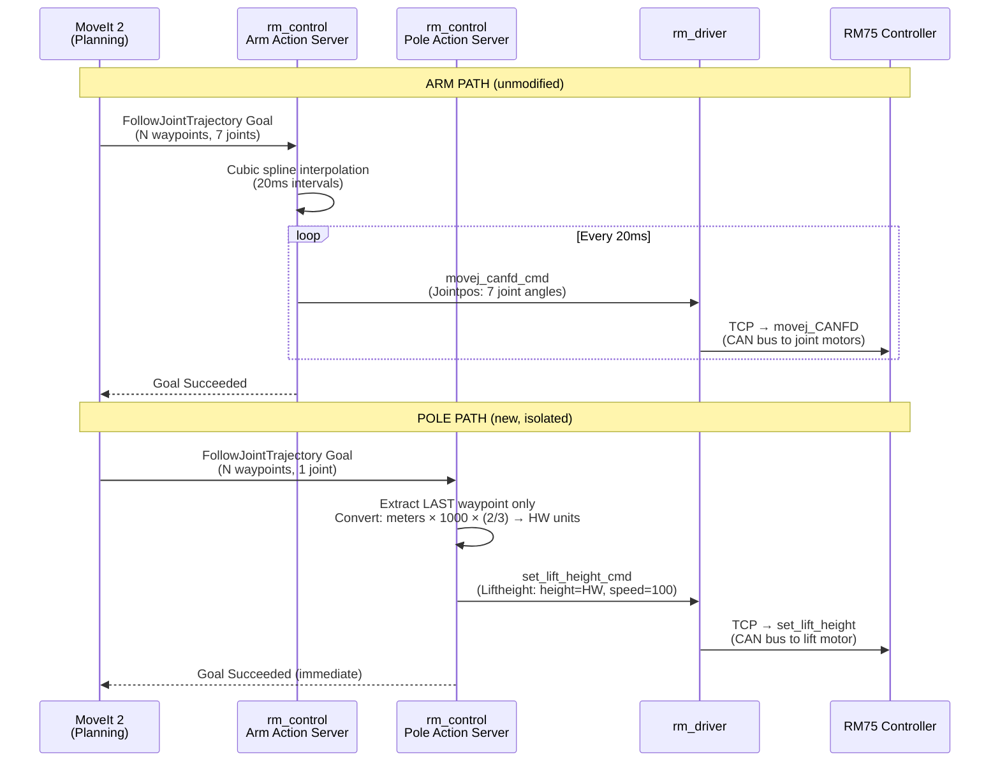
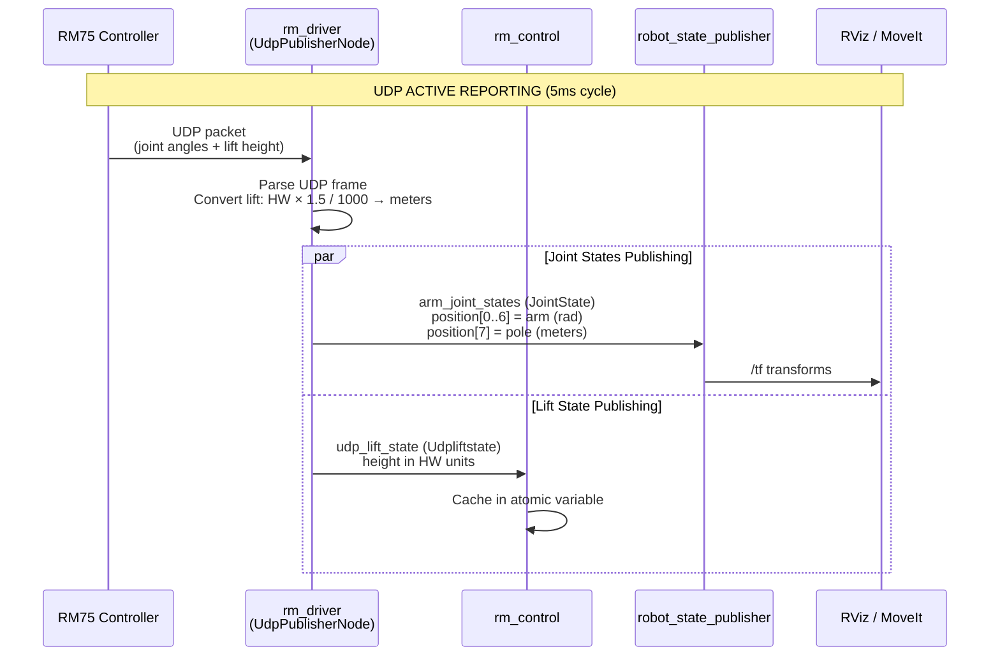
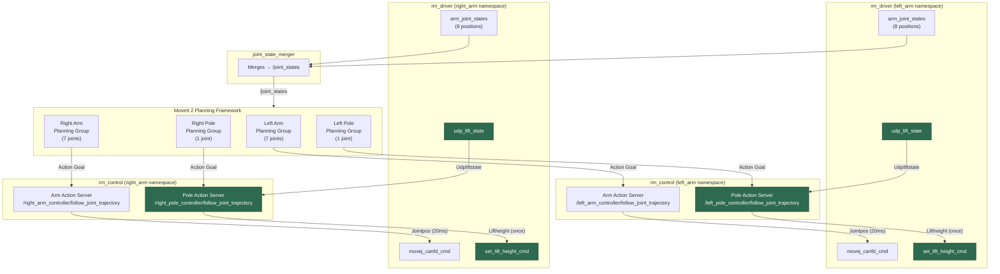

# Pole (Lift Mechanism) Integration Guide

## Revision History

| Version | Date       | Comment                                    |
|:-------:|:----------:|:------------------------------------------:|
| V1.0    | 03/09/2026 | Initial pole/lift integration documentation |

---

## Table of Contents

1. [Overview](#1-overview)
2. [System Architecture](#2-system-architecture)
3. [Communication Flow](#3-communication-flow)
4. [Protocol & Transport Details](#4-protocol--transport-details)
5. [Unit Conversion](#5-unit-conversion)
6. [ROS 2 Interface Reference](#6-ros-2-interface-reference)
7. [Configuration Reference](#7-configuration-reference)
8. [Launch Configuration](#8-launch-configuration)
9. [Design Decisions & Constraints](#9-design-decisions--constraints)
10. [Troubleshooting](#10-troubleshooting)

---

## 1. Overview

The pole (vertical lift / sliding plate mechanism) is a prismatic joint that raises and lowers the robotic arm assembly along a vertical rail. This integration adds support for commanding and monitoring the pole through the MoveIt 2 planning framework, while maintaining **complete isolation** from the arm's high-frequency joint control loop.

### Key Characteristics

| Property             | Value                                      |
|----------------------|--------------------------------------------|
| Joint type           | Prismatic (linear)                         |
| Physical range       | 0–300 mm                                   |
| Hardware range       | 0–200 hardware units                       |
| MoveIt range         | 0–0.3 m                                    |
| Joint names          | `L_sliding_plate_joint` / `R_sliding_plate_joint` |
| Control method       | Position command (fire-and-forget)          |
| Interpolation        | None — last waypoint only                  |
| Speed                | Fixed at 100%                              |

---

## 2. System Architecture

The pole integration follows a **dual-path architecture** where the arm and pole have completely independent data paths within the same `rm_control` node. This guarantees zero interference with the arm's real-time control loop.

```
┌─────────────────────────────────────────────────────────────────────┐
│                          MoveIt 2                                   │
│                                                                     │
│  ┌─────────────────────┐         ┌──────────────────────┐          │
│  │  Arm Planning Group  │         │  Pole Planning Group  │          │
│  │  (7-DOF revolute)    │         │  (1-DOF prismatic)    │          │
│  └─────────┬───────────┘         └──────────┬───────────┘          │
│            │                                │                       │
│   FollowJointTrajectory           FollowJointTrajectory             │
│   Action Goal                     Action Goal                       │
└────────────┼────────────────────────────────┼───────────────────────┘
             │                                │
             ▼                                ▼
┌─────────────────────────────────────────────────────────────────────┐
│                        rm_control Node                              │
│                                                                     │
│  ┌─────────────────────┐         ┌──────────────────────┐          │
│  │  Arm Action Server   │         │  Pole Action Server   │          │
│  │                      │         │                       │          │
│  │  • Cubic spline      │         │  • No interpolation   │          │
│  │    interpolation     │         │  • Last waypoint only │          │
│  │  • 20ms timer-based  │         │  • Fire-and-forget    │          │
│  │    streaming         │         │  • Unit conversion    │          │
│  └─────────┬───────────┘         └──────────┬───────────┘          │
│            │                                │                       │
│   movej_canfd_cmd                  set_lift_height_cmd              │
│   (Jointpos msg)                   (Liftheight msg)                 │
└────────────┼────────────────────────────────┼───────────────────────┘
             │                                │
             ▼                                ▼
┌─────────────────────────────────────────────────────────────────────┐
│                        rm_driver Node                               │
│                                                                     │
│  ┌─────────────────────┐         ┌──────────────────────┐          │
│  │  TCP Command Handler │         │  Lift Command Handler │          │
│  │  (movej_CANFD)       │         │  (set_lift_height)    │          │
│  └─────────┬───────────┘         └──────────┬───────────┘          │
│            │                                │                       │
│            ▼                                ▼                       │
│  ┌──────────────────────────────────────────────────────┐          │
│  │              UDP Active Reporting                     │          │
│  │                                                       │          │
│  │  arm_joint_states (JointState)                        │          │
│  │   ├── position[0..6] : arm joints (radians)           │          │
│  │   └── position[7]    : pole joint (meters)  ◄── NEW  │          │
│  │                                                       │          │
│  │  udp_lift_state (Udpliftstate)                        │          │
│  │   └── height : current height (hardware units)        │          │
│  └──────────────────────────────────────────────────────┘          │
└─────────────────────────────────────────────────────────────────────┘
             │                                │
             ▼                                ▼
┌─────────────────────────────────────────────────────────────────────┐
│                   RM75 Hardware Controller                          │
│                   (3rd Generation, ARM Cortex)                      │
│                                                                     │
│  ┌─────────────────────┐         ┌──────────────────────┐          │
│  │  CAN Bus → Joints    │         │  CAN Bus → Lift Motor │          │
│  │  (6/7 revolute)      │         │  (1 prismatic)        │          │
│  └──────────────────────┘         └──────────────────────┘          │
└─────────────────────────────────────────────────────────────────────┘
```

---

## 3. Communication Flow

### 3.1 Command Flow (MoveIt → Hardware)



### 3.2 Feedback Flow (Hardware → MoveIt / RViz)



### 3.3 Combined Dual-Arm Flow



---

## 4. Protocol & Transport Details

### 4.1 Transport Layer Summary

| Data Path                    | Protocol | Transport | Frequency    | Blocking |
|------------------------------|----------|-----------|--------------|----------|
| Arm joint commands           | ROS 2 Topic → TCP | TCP socket to controller | 50 Hz (20ms timer) | Non-blocking (topic) |
| Pole height command          | ROS 2 Topic → TCP | TCP socket to controller | On-demand (single shot) | Non-blocking (topic) |
| Joint state feedback (arm)   | UDP → ROS 2 Topic | UDP active reporting | 200 Hz (5ms cycle) | Non-blocking |
| Lift state feedback          | UDP → ROS 2 Topic | UDP active reporting | 200 Hz (5ms cycle) | Non-blocking |

### 4.2 Arm Control Protocol: `movej_CANFD`

The arm uses **CAN Frequency Division** (CANFD) transparent transmission. The `rm_control` node performs cubic spline interpolation on MoveIt waypoints and streams interpolated joint positions at 20ms intervals via the `movej_canfd_cmd` topic. The driver forwards these over a persistent **TCP socket** to the RM75 controller, which relays them to individual joint motors via the internal **CAN bus**.

**This path is completely untouched by the pole integration.**

### 4.3 Pole Control Protocol: `set_lift_height`

The pole uses a simple **position command** interface. A single `Liftheight` message is published to `rm_driver/set_lift_height_cmd`. The driver calls the C API function `rm_set_lift_height()` which sends the command over the same **TCP socket** (but as a separate API call, not interleaved with CANFD). The controller's firmware handles motion planning for the lift motor internally.

### 4.4 UDP Active Reporting

The RM75 3rd-generation controller supports **UDP active reporting** — the controller autonomously broadcasts its state at a configurable cycle (default: 5ms). This is independent of any command traffic and provides the lowest-latency state feedback.

The UDP frame contains:
- **Joint positions** (degrees, converted to radians for ROS)
- **Joint velocities, currents, temperatures, voltages, error codes**
- **Lift state** (height in hardware units, current, error flags) — when enabled
- **End-effector pose** (position + quaternion)
- **Force sensor data** (if equipped)

The `UdpPublisherNode` in rm_driver parses these frames and publishes decomposed data to individual ROS 2 topics.

### 4.5 ROS 2 Action Protocol: `FollowJointTrajectory`

Both arm and pole use the standard `control_msgs/action/FollowJointTrajectory` action interface, which is the native interface for MoveIt 2 trajectory execution. Each has its own action server instance:

| Component | Action Server Name (example)                            |
|-----------|----------------------------------------------------------|
| Left Arm  | `/left_arm_controller/follow_joint_trajectory`           |
| Left Pole | `/left_pole_controller/follow_joint_trajectory`          |
| Right Arm | `/right_arm_controller/follow_joint_trajectory`          |
| Right Pole| `/right_pole_controller/follow_joint_trajectory`         |

---

## 5. Unit Conversion

The pole joint uses a custom scaling between MoveIt (meters) and the hardware controller (hardware units). This stems from the physical-to-electrical gear ratio of the custom 300mm-range pole being interpreted as 200 units by the hardware.

### 5.1 Conversion Constants

| Direction          | Formula                               | Constant  |
|--------------------|---------------------------------------|-----------|
| MoveIt → Hardware  | `hw_units = meters × 1000 × (2/3)`   | ×666.667  |
| Hardware → MoveIt  | `meters = hw_units × 1.5 / 1000`     | ×0.0015   |

### 5.2 Conversion Examples

| MoveIt (m) | Physical (mm) | Hardware (units) |
|:----------:|:-------------:|:----------------:|
| 0.000      | 0             | 0                |
| 0.075      | 75            | 50               |
| 0.150      | 150           | 100              |
| 0.225      | 225           | 150              |
| 0.300      | 300           | 200              |

### 5.3 Where Conversions Happen

| Location                        | Conversion         | Code                                          |
|---------------------------------|--------------------|-----------------------------------------------|
| `rm_control.cpp` (pole_execute_move) | MoveIt → Hardware  | `height_hw = moveit_pos * 1000.0 * (2.0/3.0)` |
| `rm_driver.cpp` (udp_timer_callback) | Hardware → MoveIt  | `position[7] = hw_height * 1.5 / 1000.0`      |

---

## 6. ROS 2 Interface Reference

### 6.1 Topics — Command

| Topic                              | Message Type                          | Direction     | Description                      |
|------------------------------------|---------------------------------------|---------------|----------------------------------|
| `rm_driver/movej_canfd_cmd`        | `rm_ros_interfaces/msg/Jointpos`      | Control → Driver | Arm joint positions (radians)   |
| `rm_driver/set_lift_height_cmd`    | `rm_ros_interfaces/msg/Liftheight`    | Control → Driver | Pole height command             |

### 6.2 Topics — Feedback

| Topic                              | Message Type                              | Direction       | Description                        |
|------------------------------------|-------------------------------------------|-----------------|------------------------------------|
| `arm_joint_states`                 | `sensor_msgs/msg/JointState`              | Driver → System | Arm + pole positions (8 entries)   |
| `rm_driver/udp_lift_state`         | `rm_ros_interfaces/msg/Udpliftstate`      | Driver → Control | Raw lift state from UDP           |

### 6.3 Message Definitions

#### `rm_ros_interfaces/msg/Liftheight`
```
uint16 height        # Target height in hardware units (0–200)
uint16 speed         # Speed percentage (1–100)
bool   block         # Blocking mode (false for fire-and-forget)
```

#### `rm_ros_interfaces/msg/Udpliftstate`
```
int32   height       # Current height in hardware units (precision: 1 unit)
float32 pos          # Current angle (precision: 0.001°)
int16   current      # Current draw (mA, precision: 1 mA)
bool    en_flag      # Enable state (1=enabled, 0=disabled)
uint16  err_flag     # Driver error code
```

### 6.4 Action Servers

| Action Server                                              | Action Type                                      | Handler         |
|------------------------------------------------------------|--------------------------------------------------|-----------------|
| `/<arm>_arm_controller/follow_joint_trajectory`            | `control_msgs/action/FollowJointTrajectory`      | Arm (cubic spline, streamed) |
| `/<arm>_pole_controller/follow_joint_trajectory`           | `control_msgs/action/FollowJointTrajectory`      | Pole (last waypoint, fire-and-forget) |

---

## 7. Configuration Reference

### 7.1 Driver Configuration (`rm_driver/config/rm_75_*_config.yaml`)

| Parameter          | Type     | Default | Description                                          |
|--------------------|----------|---------|------------------------------------------------------|
| `udp_lift_state`   | `bool`   | `false` | Enable UDP active reporting for lift state            |
| `pole_joint_name`  | `string` | `""`    | Joint name for pole in `arm_joint_states` (e.g. `L_sliding_plate_joint`) |
| `arm_joints`       | `list`   | —       | List of arm joint names (unchanged)                  |

Example (left arm):
```yaml
/**:
  ros__parameters:
    udp_lift_state: true
    pole_joint_name: "L_sliding_plate_joint"
    arm_joints: ["L_joint1", "L_joint2", "L_joint3", "L_joint4", "L_joint5", "L_joint6", "L_joint7"]
```

### 7.2 Control Node Parameters (`rm_control`)

| Parameter           | Type     | Default | Description                                                     |
|---------------------|----------|---------|-----------------------------------------------------------------|
| `arm_type`          | `int`    | `75`    | Arm model (unchanged)                                           |
| `follow`            | `bool`   | `true`  | High-follow mode (unchanged)                                    |
| `action_name`       | `string` | —       | Arm action server name (unchanged)                              |
| `pole_action_name`  | `string` | `""`    | Pole action server name. **Empty = pole disabled (zero impact)** |

---

## 8. Launch Configuration

### 8.1 Control Launch File (`rm_75_control.launch.py`)

```python
# Launch arguments:
#   arm_namespace     - Namespace for the arm (e.g. 'left_arm')
#   action_name       - Arm action server name
#   pole_action_name  - Pole action server name (empty = disabled)
```

### 8.2 Bringup Launch File (`rm_75_bringup.launch.py`)

The bringup file passes `pole_action_name` to each arm's control node:

```python
left_arm_control = IncludeLaunchDescription(
    ...,
    launch_arguments={
        'arm_namespace': 'left_arm',
        'action_name': '/left_arm_controller/follow_joint_trajectory',
        'pole_action_name': '/left_pole_controller/follow_joint_trajectory',
    }.items()
)

right_arm_control = IncludeLaunchDescription(
    ...,
    launch_arguments={
        'arm_namespace': 'right_arm',
        'action_name': '/right_arm_controller/follow_joint_trajectory',
        'pole_action_name': '/right_pole_controller/follow_joint_trajectory',
    }.items()
)
```

### 8.3 Example Launch Command

```bash
# Dual-arm with pole support (uses bringup):
ros2 launch rm_bringup rm_75_bringup.launch.py

# Single control node with pole (manual):
ros2 launch rm_control rm_75_control.launch.py \
  arm_namespace:=left_arm \
  action_name:=/left_arm_controller/follow_joint_trajectory \
  pole_action_name:=/left_pole_controller/follow_joint_trajectory
```

---

## 9. Design Decisions & Constraints

### 9.1 Isolation Guarantee

The single most critical design requirement is that **pole control must never interfere with arm control**. This is achieved through:

| Mechanism                | Arm                                 | Pole                              |
|--------------------------|-------------------------------------|-----------------------------------|
| Action server instance   | `action_server_`                    | `pole_action_server_` (separate)  |
| Command topic            | `movej_canfd_cmd`                   | `set_lift_height_cmd` (separate)  |
| Feedback source          | Timer-driven spline streaming       | UDP subscriber (separate)         |
| Shared mutable state     | `point_changed`, `p2`, joint arrays | `current_lift_height_hw_` (atomic)|
| Timer callback impact    | Publishes arm joints only           | No pole code in timer callback    |

If `pole_action_name` is empty or not set, **zero** pole-related objects are instantiated — the node behaves identically to the original.

### 9.2 No Interpolation for Pole

The arm uses cubic spline interpolation to generate smooth 20ms waypoints from MoveIt's sparse trajectory. The pole does **not** use interpolation because:

1. The lift motor has its own internal motion planner with trapezoidal velocity profiles.
2. The pole's motion is simple (1-DOF linear) and does not require path smoothness.
3. Sending a single position command with `speed=100%` lets the hardware handle acceleration/deceleration optimally.

### 9.3 Last Waypoint Only

MoveIt may send multiple waypoints for the pole joint. Only the **last waypoint** is used because:

1. Intermediate waypoints are meaningless without interpolation.
2. The lift motor's firmware plans a single motion to the target height.
3. This avoids unnecessary command chatter on the TCP socket.

### 9.4 Fire-and-Forget Goal Completion

The pole action server succeeds the goal **immediately** after publishing the command, without waiting for the lift to reach the target. This is because:

1. Waiting would require polling the UDP feedback and blocking the action thread.
2. The lift motion time is unpredictable (depends on distance and load).
3. MoveIt can proceed with arm planning while the pole moves in parallel.

### 9.5 Joint States Extension

The driver's `arm_joint_states` topic is extended from 7 to 8 entries when pole support is enabled. The pole is appended at index 7 (position 8) to maintain backward compatibility — existing consumers that read indices 0–6 are unaffected.

---

## 10. Troubleshooting

| Symptom | Cause | Solution |
|---------|-------|----------|
| Pole not moving | `pole_action_name` is empty | Set `pole_action_name` in launch arguments |
| Pole not moving | `udp_lift_state` is `false` in driver config | Set `udp_lift_state: true` in YAML |
| Pole position not in `/joint_states` | `pole_joint_name` not set in driver config | Add `pole_joint_name: "L_sliding_plate_joint"` to YAML |
| Pole position wrong in RViz | Unit conversion mismatch | Verify URDF joint limits match 0–0.3m range |
| "Error Code -2" on arm | UDP packet overload | Increase `udp_cycle` from 5 to 10 in driver config |
| Arm motion stutters | Pole code interfering (should not happen) | Verify `pole_action_name` uses a different action name than `action_name` |
| Goal rejected with "0 waypoints" | MoveIt sent empty trajectory | Check pole planning group configuration in MoveIt |

---

## Files Modified

| File | Package | Change |
|------|---------|--------|
| `include/rm_control.h` | rm_control | Added pole action server, lift publisher/subscriber, state variables |
| `src/rm_control.cpp` | rm_control | Added pole `execute_move`, UDP callback, conditional initialization |
| `launch/rm_75_control.launch.py` | rm_control | Added `pole_action_name` launch argument |
| `include/rm_driver/rm_driver.h` | rm_driver | Added `pole_joint_name_g` global, `pole_joint_name_` member |
| `src/rm_driver.cpp` | rm_driver | Extended `arm_joint_states` to include pole, reads `pole_joint_name` param |
| `config/rm_75_left_config.yaml` | rm_driver | Added `pole_joint_name: "L_sliding_plate_joint"` |
| `config/rm_75_right_config.yaml` | rm_driver | Added `pole_joint_name: "R_sliding_plate_joint"` |
| `launch/rm_75_bringup.launch.py` | rm_bringup | Added `pole_action_name` to left/right arm control includes |
